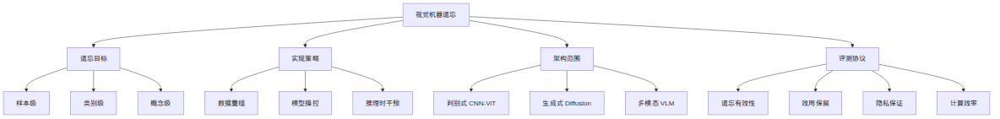
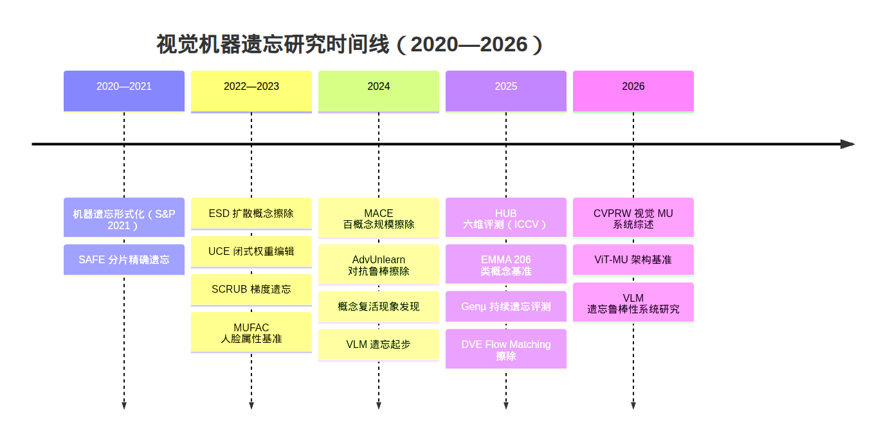

# Machine Unlearning in Computer Vision: Methods, Benchmarks, and Robustness

## Abstract

Machine unlearning (MU) aims to remove the influence of specific data points, classes, or semantic concepts from trained models without full retraining. In computer vision, this capability is increasingly required for privacy compliance, copyright protection, and safety alignment across face recognition, medical imaging, text-to-image generation, and vision-language assistants. This survey organizes 2020--2026 vision unlearning research along four axes---targets, strategies, architectures, and evaluation---covering discriminative classifiers (CNNs and Vision Transformers), diffusion models, and vision-language models (VLMs). We highlight a fundamental gap between discriminative parameter-space forgetting and generative concept erasure in entangled latent spaces, and show that many methods achieve only superficial suppression under adversarial probing. We conclude with open challenges toward verifiable and robust vision unlearning.

**Keywords:** machine unlearning, computer vision, concept erasure, diffusion models, vision-language models, robustness

## 1. Introduction

Computer vision is not a peripheral application of machine unlearning; it is one of the domains where technical difficulty and societal impact concentrate most sharply. Unlike text-only models, vision systems process high-dimensional perceptual signals whose information is distributed across spatial features, cross-modal alignments, and generative latent spaces. The ``right to be forgotten'' established by GDPR and CCPA requires that deployed models no longer encode a subject's identity, medical characteristics, or copyrighted style after a deletion request. Meanwhile, text-to-image systems must suppress celebrity portraits, NSFW content, and proprietary IP characters, and vision-language models must disentangle sensitive image--text associations. These needs map onto sample/class removal in classification, identity erasure in person re-identification, concept suppression in diffusion models, and cross-modal decoupling in multimodal models [1][2].

From an industrial perspective, vision unlearning is no longer a purely academic setting. Face recognition services must delete memory of a user's appearance after consent withdrawal; medical imaging systems must erase training traces of specific exams; open-source text-to-image communities must remove styles or characters upon copyright complaints. Zhang et al. [9] provide terminology and taxonomy for general MU, but vision exhibits more complex failure modes: a model may ``refuse'' a concept in explicit outputs while retaining recoverable cues in latent representations or conditional generation. Bourtoule et al. [1] formalized MU at IEEE S&P 2021 and proposed shard-based approximate exact forgetting. The vision community rapidly extended this paradigm to classifiers, generators, and multimodal foundation models. The CVPRW 2026 survey of Safavigerdini et al. [2] charts the trajectory from discriminative erasure to generative concept suppression and robust unified frameworks, while the ICCV 2025 HUB benchmark [3] marks a shift from ``can we erase'' to ``can erasure survive multi-dimensional threats.''

### 1.1 Problem Formulation

Let $f_\theta$ be trained on $\mathcal{D}$, with forget set $\mathcal{D}_f\subset\mathcal{D}$ and retain set $\mathcal{D}_r=\mathcal{D}\setminus\mathcal{D}_f$. MU seeks parameters $\theta'$ such that $f_{\theta'}$ behaves as if $\mathcal{D}_f$ were never seen, preserves utility on $\mathcal{D}_r$, and updates at far lower cost than retraining from scratch [1]. Exact unlearning requires statistical indistinguishability from a model retrained only on $\mathcal{D}_r$; approximate unlearning relaxes this guarantee for computational feasibility [9]. In vision practice, exact unlearning is largely restricted to small classifiers, whereas generative foundation models almost always use approximate or heuristic concept suppression. Deletion requests themselves differ: some remove a single user sample, others an entire class label, and others a semantic concept that is not a closed class. Unclear target definitions make evaluations incomparable [9], which motivates stating a four-axis taxonomy before reviewing methods.

### 1.2 Scope and Positioning

This survey focuses on vision-specific work from 2020--2026, primarily from CVPR, ICCV, NeurIPS, IEEE S&P, WACV, and arXiv. Pure LLM unlearning is included only when adapted to VLMs. Relative to [2], we emphasize evaluation and robustness. Relative to general MU surveys [9], we concentrate on three vision architectures and their cross-cutting challenges. The paper contains no original experiments; claims are traceable to the cited literature.

## 2. Taxonomy and Architectures

### 2.1 Four-Axis Taxonomy

Following [2], we organize the literature along four axes (Fig. 1): forgetting targets (sample/class/concept), implementation strategies (data reorganization, model manipulation, inference intervention), architecture scope (discriminative, generative, multimodal), and evaluation protocols (forgetting, utility, privacy, efficiency). Cross-products of these axes provide a skeleton for literature search: a method is best understood as a target--strategy--architecture--evaluation combination rather than as an isolated acronym.

### 2.2 Architectural Mechanisms

Discriminative models operate on decision boundaries and feature geometry. Zhao et al. [5] show that Vision Transformers often retain higher utility after unlearning than CNNs, whereas CNNs are more compatible with gradient-style methods. Generative diffusion models encode concepts largely in cross-attention, motivating ESD [6] and UCE [7]; U-Net trajectories, text-encoder embeddings, and classifier-free guidance can still act as residual channels. VLMs must handle entanglement among vision encoders, text encoders, and fusion decoders. Lin et al. [4] show that suppressing text-side outputs alone does not guarantee unrecoverable visual associations. The core difficulty is interrupting a cross-modal reinforcement loop.

Fig. 2 summarizes key milestones from formalization and shard-based exact forgetting, through ESD/UCE and SCRUB, to mass concept erasure, adversarial robustness, multi-dimensional benchmarks, and systematic ViT/VLM studies.

## 3. Discriminative Vision Unlearning

### 3.1 Exact and Approximate Forgetting

Exact unlearning is represented by Bourtoule et al. [1], who shard training data across submodels to reduce deletion cost. For large vision classifiers, approximate methods dominate. SCRUB [8] combines gradient ascent on the forget set with retain-set distillation. Projected-gradient and guided loss-increasing objectives reduce interference and utility collapse; boundary unlearning shifts the operation from parameters to decision boundaries. Zhao et al. [5] find that CNN-designed algorithms transfer poorly to ViTs under unified capacity and continual-unlearning protocols. Marasco et al. [10] argue that unlearning should be a lifecycle capability rather than a one-shot patch.

### 3.2 Representation- and Knowledge-Level Forgetting

Editing logits is often insufficient. Representation-level methods surveyed in [2] exploit Neural Collapse geometry or impose filter sparsity/orthogonality to disentangle class-specific representations, with CKA-based scores comparing forgotten models to gold-standard retrains. Parameter-localization methods identify sensitive subsets rather than updating the entire network. Guarantees remain largely confined to closed-set classification.

### 3.3 Specialized Vision Scenarios

Face and person-centric tasks require instance-level forgetting while preserving non-identity attributes [2]. Person re-identification further demands post-forgetting non-retrievability. Across these settings, the forget object is a composite semantic structure, so task semantics matter as much as optimization algorithms.

## 4. Concept Erasure in Diffusion Models

### 4.1 Fine-Tuning versus Closed-Form Editing

ESD [6] aligns target-concept noise prediction with neutral prompts and highlights cross-attention as a structural hub. UCE [7] casts cross-attention editing as closed-form optimization suitable for urgent online deletion. MACE [11] scales erasure to about one hundred concepts via closed-form refinement and per-concept LoRA. Fine-tuning typically erases more thoroughly but is costly; closed-form and training-free routes are efficient yet more fragile under attack [3].

### 4.2 Neuron-Level and Latent Interventions

Sparse autoencoders, prototype-guided negative conditioning, and intermediate-generation correctors localize narrow concepts more precisely [2]. Broad categories such as NSFW remain difficult, and erasing a narrow concept can damage shared super-types, creating an erasure--fidelity tension [2]. Collateral effects on neighboring semantics must be reported [3].

### 4.3 Realistic Evaluation Constraints

White-box embedding/latent protocols show high concept recreation rates for advanced methods [2][3]. HUB [3] covers six axes and finds that no single method leads on all. Continual-erasure suites require sequential removals to preserve retained concepts. The field has moved from producing clean images to sustaining erasure under adversarial, multilingual, and continual-update conditions.

## 5. Vision-Language Model Unlearning

### 5.1 Method Families

Lin et al. [4] organize VLM unlearning into full-parameter fine-tuning, vision-encoder fine-tuning, selective-parameter updates, and inference-time intervention. Vision-encoder updates are often effective for discriminative probes, suggesting encoder-rooted visual memory. Cross-modal decoupling and hyperbolic alignment calibration further address bidirectional vision--language dependence.

### 5.2 Cross-Modal Entanglement and Evaluation

Models may refuse under direct prompts yet recover associations under paraphrases, context, or retraining [4]. Many methods hide rather than erase. Evaluation must include multi-prompt variants, retraining recovery rates, and cross-modal probes---especially for medical or legal deployments.

## 6. Robustness, Attacks, and Defenses

### 6.1 Suppression versus Erasure

Concept revival after unrelated fine-tuning [2] and VLM reactivation attacks [4] show that standard-prompt evaluation overestimates erasure. Robustness is a necessary condition for claiming unlearning, not an optional add-on.

### 6.2 Adversarial Attacks and Defenses

Attacks include white-box prompt reconstruction, black-box semantic substitution, and VLM contextual/retraining attacks [2][4]. AdvUnlearn [12] injects adversarial prompts during training; other defenses expand prompt coverage, adversarially train, or perturb latents at inference. No method yet provides provable guarantees under all threat models. HUB [3] is valuable for standardized, reproducible attack evaluation.

### 6.3 Worst-Case Evaluation

Forget-set accuracy and average-case membership inference can be manipulated [2]. Emerging metrics include feature-level residual checks, stricter likelihood-ratio attacks, and worst-case forget sets. Membership is not concept recoverability; future benchmarks should include adversarial conditions by default.

## 7. Benchmarks and Evaluation

Discriminative evaluation has moved from CIFAR class deletion toward instance-level and architecture-aware protocols such as ViT-MU [5]. Generative evaluation is anchored by HUB [3] and related suites covering implicit prompts, continual erasure, hierarchical semantics, and multimodal triggers. Effective reporting should balance forgetting efficacy, utility retention, privacy guarantees, and efficiency rather than maximize a single score. Choosing a benchmark is about threat-dimension coverage, not mere availability.

## 8. Discussion and Open Challenges

### 8.1 Contributions

Past six years yielded formal MU foundations [1], a coherent vision taxonomy [2], scalable concept erasure [6][7][11], VLM robustness analysis [4], and public benchmarks [3][5]. Lifecycle perspectives further shift understanding from one-shot algorithms to system capability [10].

### 8.2 Gaps

Generative and multimodal unlearning lack strong formal guarantees; continual deletion induces cumulative retain--forget conflicts; legal irreversibility still lacks technical adjudication standards [2][10]. Cross-architecture transfer remains largely aspirational.

### 8.3 Future Directions

Promising directions include representation-level geometric forgetting, adversarially trained erasure [12], interpretable neuron surgery for video/Flow Matching, and unified lifecycle frameworks that couple methods, benchmarks, and compliance evidence [2][10]. Vision unlearning should become adversarial, multimodal, and lifecycle-aware by default.

## 9. Conclusion

Vision machine unlearning spans discriminative, generative, and multimodal systems with distinct failure modes. Discriminative work seeks verifiable representation-level deletion; generative erasure must confront semantic entanglement and revival; VLMs must resist cross-modal reactivation. Benchmarks such as HUB and ViT-MU provide shared infrastructure, yet no method is robust across all evaluation axes. The field is moving from ``can we erase'' toward ``can we prove erasure.'' Building verifiable, auditable, and attack-resilient vision unlearning remains a pressing open problem at the intersection of computer vision and AI safety.

## References

[1] BOURTOULE L, et al. Machine unlearning. IEEE S&P, 2021.

[2] SAFAVIGERDINI K, et al. Machine unlearning in computer vision: survey of methods from discriminative to generative foundation models. CVPR Workshops, 2026.

[3] MOON S, et al. Holistic unlearning benchmark: a multi-faceted evaluation for text-to-image diffusion model unlearning. ICCV, 2025.

[4] LIN Y, et al. On the robustness of machine unlearning for vision-language models. arXiv:2605.26992, 2026.

[5] ZHAO Y, et al. Benchmarking unlearning for vision transformers. arXiv:2602.20114, 2026.

[6] GANDIKOTA R, et al. Erasing concepts from diffusion models. ICCV, 2023.

[7] GANDIKOTA R, et al. Unified concept editing in diffusion models. WACV, 2024.

[8] KURMANJI M, et al. Towards unbounded machine unlearning. NeurIPS, 2023.

[9] ZHANG H, et al. A review on machine unlearning. SN Computer Science, 2023.

[10] MARASCO E, et al. Revisiting the machine unlearning ecosystem in vision: from afterthought to a lifecycle perspective. Neurocomputing, 2026.

[11] LU S, et al. MACE: Mass concept erasure in diffusion models. CVPR, 2024.

[12] ZHANG Y, et al. AdvUnlearn: adversarial training for robust concept erasure of diffusion models. 2024.
